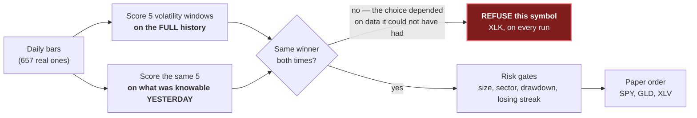

# Hindsight Alpha

[](https://github.com/s-papy/hindsight-alpha/actions/workflows/garde-fou.yml)
[](LICENSE)
[](#status)

**Most trading agents bound risk. This one bounds self-deception.**

An options agent that scores every parameter twice — on the full history, and
on only what was knowable yesterday — and **refuses to trade** when the two
winners disagree. Re-run before every decision, not once at design time.

Entry for the **Alpaca AI Trading Agents Hackathon** (lablab.ai, deadline
04/09/2026). Paper trading only, zero real funds at risk.

**Live dashboard: [s-papy.github.io/hindsight-alpha](https://s-papy.github.io/hindsight-alpha)** —
every run, every refusal, every real order. It is a *snapshot*, republished
every 30 minutes during market hours, and the page says so itself when it goes
stale.

### The mechanism, in one picture



Every box runs **before every decision**. The refusal on the left is the result
worth judging — not the P&L on the right.

| | |
|---|---|
| **The mechanism** | scores each parameter twice, refuses the symbol when the two winners disagree |
| **Does it catch anything real?** | yes: XLK is refused live, every run, on real bars |
| **Risk** | paper only, enforced in code; per-trade, total-exposure, sector, drawdown and consecutive-loss caps; the most any position can lose is the premium paid |
| **Proof it runs** | a real paper order filled on the submitted account; the exit loop has closed positions for real; 700+ offline tests, and the full suite runs in CI on every push |

### How honest is the check itself?

A refusal mechanism whose error rate is unknown is worth less than one whose
error rate is measured. So it was measured, twice, by two different
constructions — and both numbers are published because quoting only the lower
one is the selective reporting this project exists to denounce.

- **22.6 % false alarms** — [HINDSIGHT_HOLDOUT.md](HINDSIGHT_HOLDOUT.md) plants
  an anomaly in synthetic prices and varies the holdout.
- **30.2 % false alarms** — [HINDSIGHT_BENCHMARK.md](HINDSIGHT_BENCHMARK.md)
  works at the score level against known ground truth.
- **52 %**: on a selection with no edge *and* no leak — a winner picked by noise
  alone — the guard certifies it anyway. It does not catch
  overfitting-without-look-ahead, and nothing else in the chain does either.

The XLK disagreement is **0.024 of a Sharpe unit** in-sample, and it disappears
on the IEX feed instead of the consolidated SIP one. The two series the guard
compares overlap by 97 % by construction, so the deciding gap is small by
design. The honest reading is not "XLK leaks, proven" — it is that a falsifiable
test runs before every trade, fires on real bars every run, and has had its own
error rate published rather than assumed.

### Backtest, at a glance

*Every window tested, and the caveats on units: `BACKTEST_RESULTS.md`.*

| Symbol | Vetted window | `hindsight_guard` | Trades (of ~657 bars) | Win rate | Gain from best 5 days |
|---|---|---|---|---|---|
| SPY | 10d | ✅ clean | 102 | 45.1% | 82.6% |
| GLD | 20d | ✅ clean | 56 | 57.1% | 68.5% |
| XLV | 10d | ✅ clean | 52 | 50.0% | 78.2% |
| XLK | 90d | 🛡️ **LEAK — refused live** | 76 (not traded) | 36.8% | 136.7% |

A concentration share above 100 % isn't an error: XLK's best 5 days earned more
than its entire net result, i.e. every other trade day combined lost money. High
concentration on the three clean symbols too (68.5–82.6 %) means a positive
result from 52–102 trades does not yet distinguish edge from luck. **The result
worth judging is not the P&L.**

### Pre-event work, disclosed

The organisers' FAQ permits pre-kickoff work and requires that it be disclosed.
Counted from git rather than remembered:

**187 of this repository's 292 commits — 64% — predate the kickoff instant**
(Friday 28 August 2026, 09:30 ET), counted on 30 August. A test compares that
published number against the real one.

Nothing was traded on the competition account before kickoff: its order history
contains exactly one pre-Monday order, submitted 28/08 at 19:37 UTC, *after*
kickoff. Development ran on a **separate** paper account, as the rules allow.
Full provenance in [LIVE\_WEEK.md](LIVE_WEEK.md).

### If you have five minutes

1. **[The refusal, live](https://s-papy.github.io/hindsight-alpha)** — XLK
   refused on every run, on real bars.
2. **[What will be reported on 04/09](LIVE_WEEK.md)** — written *before* the
   results were known, including what would count as a failure. A losing week
   explicitly would not.
3. **[What the numbers do not prove](#backtest-at-a-glance)** — the section
   where this project argues against its own backtest.

## What the agent does

Each run evaluates a small universe of liquid, optionable ETFs — default
`SPY,GLD,XLK,XLV`, configurable via `--symbols`. Several symbols apply the
*same* gate more times; they do not relax it. Every symbol clearing every gate
gets a real entry attempt, never two on the same underlying.

For each symbol:

1. **Fetch** daily bars via Alpaca's Market Data API.
2. **Sweep** 5 candidate historical-volatility windows (10, 20, 30, 60, 90 days)
   for one rule: *buy optionality when realized volatility is cheap relative to
   its own trailing distribution, sit out when it isn't.* The decision to trade
   is a volatility-regime call, not a directional bet dressed up as an option.
3. **Check for leakage** — `hindsight_guard.check_selection_leakage` scores
   every candidate twice: on the full history, and on everything except the most
   recent 20 bars. It compares the two winners.
4. **Refuse** if they disagree, if nothing clears the Sharpe bar in-sample, or
   if any candidate could not be scored at all — and print why. This is the
   point of the project: not a better signal, but an agent honest about when its
   own selection does not hold up out of sample.
5. **Otherwise**, check today's volatility regime with the vetted window. If
   volatility isn't cheap, sit out — an ordinary "no edge" refusal, not a
   leakage problem. If it is, a momentum tiebreaker picks a direction and the
   agent finds a near-the-money contract, 7–21 days out, **bought never sold**.
6. **Pass the risk gates**, or don't trade.

Design rationale — prior art, why HV rank rather than momentum, why the CLI
rather than the MCP server, and the agent-level controls — is in
[DESIGN_NOTES.md](DESIGN_NOTES.md).

### Risk gates

See `risk_gates.py`. An agent that can buy every day with no cap on position
count or capital at risk isn't a trading agent, it's a liability generator with
a good idea buried inside it.

- **Entry**: up to 4 concurrent positions, one per underlying. A 1 %-of-equity
  per-trade cap sized from the contract's **live ask**, and a 3 %-of-equity cap
  on total premium across every open position — so a second position shrinks the
  budget for the next one instead of getting a fresh 1 %. On top of both, a
  1.5 %-of-equity cap per sector (`MAX_SECTOR_EXPOSURE_PCT`).
- **Drawdown lock**: 3 % from the recorded starting equity, persisted in
  `state.json` across days. Named "weekly" in the code but measured from the
  first equity ever recorded — **there is no week-boundary reset**. It never
  releases on its own, deliberately, matching the consecutive-loss breaker's
  "stop and let a human look" rule.
- **Exit**: `manage_exits()` runs *before* any new-entry evaluation and closes
  anything at +50 % or −50 % unrealized. Alpaca does not support bracket or OCO
  orders on options, so this polling loop is the **only** mechanism protecting
  an open position — `monitor_exits.py` runs it every 15 minutes through the
  session, including the close.
- **Manual stop**: create a file named `HALT` at the repo root and no new entry
  is opened; exits keep running. No code edit, no credential touched.

### What runs unattended

Five `launchd` schedules, versioned in `launchagents/` rather than living on
one machine. A judge should be able to see every automatic behaviour, so each
one is named with what it actually launches.

- **`launchagents/com.hindsightalpha.agent-daily.plist`** — the entry decision,
  once per trading day at 21:37 local (15:37 ET), twenty-three minutes before
  the US close. That hour is not arbitrary: the signal is a volatility rank
  computed on daily closes, and mid-session the most recent bar is still
  today's partial one. The later the run, the closer that bar is to the real
  close. The odd minute keeps it clear of the exit monitor, which fires on
  rounder ones — sharing a minute means both processes contend for the same
  state file.

- **`launchagents/com.hindsightalpha.monitor-exits.plist`** — exits only, every
  15 minutes through the session and including the closing bell. Alpaca has no
  bracket or OCO orders on options, so this loop is the only thing protecting
  an open position. The last quarter-hour of the session, the highest-volume
  window of the day, used to have no check at all; a position crossing its stop
  there would have stayed open overnight.

- **`launchagents/com.hindsightalpha.market-hours-awake.plist`** — a
  `caffeinate` job holding the machine awake from 15:20 to 22:20 on weekdays
  — seven hours, twenty minutes past the close. A test derives that end time
  from the plist rather than trusting this sentence.
  It exists because the exit monitor once failed eleven times in a row: not a
  permissions fault, but a sleeping machine that `launchd` woke only for
  maintenance windows too short for Wi-Fi to reconnect. Each failure timestamp
  matched the system sleep log to the second. Keeping the machine awake is now
  a configuration rather than a habit.

- **`launchagents/com.hindsightalpha.publish-dashboard.plist`** — runs
  `publish_dashboard.py --git-push` every 30 minutes through the session, plus
  once just after the close. This is a deliberate reversal of a rule this
  project used to hold: publishing to the public repository was kept a manual
  act each time, on the grounds that pushing is a decision rather than a step.
  But the page is the submission's application URL and the README calls it
  live, so a rule that left it stale most of the time was protecting the wrong
  thing. The rule is amended here rather than quietly ignored.

- **`launchagents/com.hindsightalpha.push-pending.plist`** — runs
  `publish_dashboard.py --pousser-seulement` every 30 minutes, seven days a
  week. No API call, no order, no commit created: it publishes commits already
  made, or does nothing at all. Publishing the dashboard is a market-hours job,
  while work accumulates in the evenings and at weekends.

## Setup

**Python 3.9 or newer.** That is the version the agent actually runs on, and CI
verifies both ends — 3.9 and the latest 3.x — so this line is checked, not
promised.

```bash
# 1. Install the Alpaca CLI (not a pip package)
brew install alpacahq/tap/cli          # macOS/Linux
alpaca doctor                          # verify install

# 2. Python deps (just python-dotenv)
pip install -r requirements.txt

# 3. Credentials
cp .env.example .env                   # paper key id + secret + account ID

# 4. Run
python3 -m unittest discover   # 700+ offline tests, no credentials needed
python test_connection.py      # confirms CLI install + credentials + network
python agent.py --dry-run      # full leakage check, no order placed
python agent.py                # if vetted, places a real (paper) options order
```

## Repository map

| | |
|---|---|
| `hindsight_guard.py` | the leakage-detection library, vendored so the agent depends on no sibling repo |
| `vol_strategy.py` | the HV-rank strategy: candidate windows, full-window and in-sample scoring |
| `agent.py` | the pipeline — market check, fetch, sweep, leakage check, risk gates, trade or refuse |
| `risk_gates.py` | every cap and lock above, plus the exit chain. State in `state.json` |
| `alpaca_cli.py` | subprocess wrapper around Alpaca's official CLI — what satisfies the "MCP or CLI" requirement |
| `monitor_exits.py` | standalone exit-only monitor, scheduled independently of the daily entry cycle |
| `decision_log.py` | one JSON record per run in `decision_log.jsonl`, committed — evidence, not a secret |
| `publish_dashboard.py` | snapshots account, positions and decisions into `docs/data.json` |
| `docs/index.html` | the dashboard: one static page, no build step, no framework |
| `backtest.py`, `compare_strategies.py` | real backtests on real bars, reusing the project's own scoring code |
| `momentum_strategy.py` | a second strategy family, not traded live — kept so the head-to-head is measured, not asserted |
| `garde_fou.py` | 23 checks that run before anything here is published |
| `launchagents/` | the five macOS schedules, versioned rather than living on one machine — see below |
| `test_*.py` | 700+ tests, standard library only, no network — CI runs them on every push |

## Hosted dashboard

**GitHub Pages serving `docs/`**, not a separate server, for one reason: the
public page never needs to see an API key. `publish_dashboard.py` runs locally
with real credentials, writes a plain JSON snapshot, and that snapshot — not a
live connection — is what gets committed and served. Nothing publicly reachable
touches Alpaca directly.

`git_publish()` scopes both its diff check and its commit to `docs/data.json`
and `decision_log.jsonl` explicitly, so an unrelated file staged at that moment
cannot be scooped into a commit claiming to be a dashboard snapshot.

## Status

Paper trading only, enforced in two independent layers: `cli_env()` **removes**
`ALPACA_LIVE_TRADE` from the environment handed to the CLI, so the CLI cannot
see it whatever its spelling; and `require_credentials()` refuses to start on
any value that isn't an explicitly recognised falsy one.

**Proven end-to-end against the real API**, not only against mocks:

- The dedicated competition account is connected and trading — it started at
  exactly $100,000, was created for this hackathon, and its number is shown on
  the public dashboard so it can be checked against the submission.
- A real paper option order was submitted and later closed by a real
  take-profit / stop-loss check. `HALT` blocked new entries without blocking an
  exit already in progress, and the duplicate-order guard triggered.
- `hindsight_guard` refuses XLK live, on real bars.

**Known limits, stated rather than discovered:** the exit loop is the only thing
protecting an open position, so the machine must stay awake through US market
hours — a `caffeinate` schedule handles it, and the dashboard shows a health
banner so a gap is visible publicly instead of only in a local log. After an
option is exercised at expiry the resulting equity line is invisible to the
entry gates; it is reported, not silently handled.

## License

MIT (`LICENSE`), as the competition requires. Anyone may copy, modify and
redistribute this code, the only obligation being to keep the copyright notice.

No credential ever reaches this repository. `.env` is gitignored and has never
been committed — `garde_fou.py` re-checks that against the full git history on
every run.
